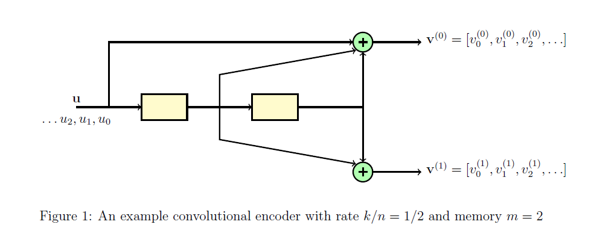

# Theory
The theory associated with Experiment-5 is divided into two parts:

(1) Encoding of convolutional codes  
(2) Viterbi decoding 

## 1  Encoding of convolutional codes
In experiment 1, we studied block codes and linear block codes. Convolutional codes are linear codes, but they are not "block" codes. For a block code, the given long stream of input bits is first divided into short message blocks and then a codeword is assigned to each message block. In convolutional codes, the input bitstream is directly given to the encoder, without dividing it into short message blocks. The output of convolutional encoder is the  encoded bitstream corresponding to the input bitstream. Another main difference between block codes and convolutional codes is that the convolutional encoder has a "memory". For a convolutional code, the encoded output bit at any given time depends not only on the current input bits but also on previous input bits, hence the encoder is said to have a memory.       

We shall now recall some basics about convolutional encoder. We shall focus on non-systematic feedforeward encoders of rate $1/n$. Please refer [1], [2] for a detailed discussion about convolutional codes. We shall introduce the basics of convolutional encoder through an example. Throughout this section, we shall focus on the rate $1/2$ convolutional encoder illustrated in Figure~1. As shown, this encoder consists of the system formed by two shift register, two adders, and the corresponding connections. The memory $m$ of this encoder is equal to the number of shift registers.  

For Figure 1, we have $m=2$. The input bitstream is denoted by $\mathbf{u} = [u_0, u_1, u_2, ...]$ such that at time instant $t$, the bit $u_t$ enters the system. The contents of the shift registers at time $t$ are $u_{t-1}$ and $u_{t-2}$ respectively. For the sake of simplicity we shall assume that at time $t=0$, the contents of both the shift registers are empty, i.e., bit $0$ is stored at both the registers.The output of the encoder consists of two bitstreams denoted by 
$\mathbf{v}^{(0)} = [v_0^{(0)}, v_1^{(0)}, v_2^{(0)}, ...]$ and $\mathbf{v}^{(1)} = [v_0^{(1)}, v_1^{(1)}, v_2^{(1)},...]$ such that the final encoded bitstream is given by  $\mathbf{v}$ $=$ $[v_0^{(0)}, v_0^{(1)}, v_1^{(0)}, v_1^{(1)}, v_2^{(0)}, v_2^{(1)}, ...]$.

Let $\mathbf{g}^{(0)}$ and $\mathbf{g}^{(1)}$ denote the connections corresponding to the first and second output of the encoder. In general, each $\mathbf{g}^{(j)}$ corresponds to the impulse response of the linear system corresponding to the encoder. For a non-systematic feedforeward encoder with memory $m$, each $\mathbf{g}^{(j)}$ will be a vector of length $m+1$ given by $\mathbf{g}^{(j)} = [g_0^{(j)} g_1^{(j)} g_m^{(j)} ...]$. $\mathbf{g}^{(0)}$ and $\mathbf{g}^{(1)}$ are called _generator sequences_ of the encoder. For the encoder illustrated in Figure 1, $\mathbf{g}^{(0)}$ and $\mathbf{g}^{(1)}$ are given by
$$\mathbf{g}^{(0)} = [1 1 1] $$ 
&emsp;&emsp;&emsp;&emsp;&emsp;&emsp;&emsp;&emsp;&emsp;&emsp;&emsp;&emsp;&emsp;&emsp;&emsp;&emsp;&emsp;&emsp;&emsp;&emsp;&emsp;&emsp;&emsp;&emsp;&emsp;&emsp;&emsp;&emsp;&emsp;&emsp;&emsp;&emsp;&emsp;&emsp;&emsp;&emsp;&emsp;&emsp;&emsp;&emsp;&emsp;&emsp;(1) $$\mathbf{g}^{(1)} = [0 1 1].$$ 
The $t$-th output bit $v_t^{(j)}$ of output sequence $\mathbf{v}^{(j)}$ for $j = 1, 2$ is given by  
&emsp;&emsp;&emsp;&emsp;&emsp;&emsp;&emsp;&emsp;&emsp;&emsp;&emsp;&emsp; $v_t^{(j)} =$ $\mathbf{u}$ $\star$ $\mathbf{g}^{(j)}$
&emsp;&emsp;&emsp;&emsp;&emsp;&emsp;  $:=$ $\sum_{i=0}^m$  $u_{t-i} g_i^{(j)}$ 
 

&emsp;&emsp;&emsp;&emsp;&emsp;&emsp;&emsp;&emsp;&emsp;&emsp;&emsp;&emsp; $=$ $u_t$ $g_0^{(j)}$ $+$ $u_{t-1}$ $g_1^{(j)}$ $+$ ... $+$ $u_{t-m}$ $g_m^{(j)}$,  
where $\star$ denotes the convolution operation. From Eq (1), for the encoder illustrated in Figure 1, at any time instance $t$,  $v_t^{(0)}$ and $v_t^{(1)}$ are given by  
&emsp;&emsp;&emsp;&emsp;&emsp;&emsp;&emsp;&emsp;&emsp;&emsp;&emsp;&emsp;  $v_t^{(0)}$ $=$ $u_t + u_{t-1} + u_{t-2}$  
 
&emsp;&emsp;&emsp;&emsp;&emsp;&emsp;&emsp;&emsp;&emsp;&emsp;&emsp;&emsp;  $v_t^{(1)}$ $=$ $u_{t-1} + u_{t-2}$. 

It can be seen that the $t$-th output bit depends on $m$ previous input bits and hence the encoder is said to have memory $m$. Since the output bit is obtained by taking convolution of the input bitstream and the generator sequence, this code is called as _convolutional code_.   

Observe that for the example of Figure 1, for each input bit $u_t$, we get two output bits ($v_t^{(0)}$ and $v_t^{(1)}$) and hence the rate of this code is equal to $1/2$. Similarly one can have rate $1/n$ convolutional code. Note that one can design a convolutional code with any arbitrary rate $k/n$ with $k>1$. For a rate $k/n$ convolutional code, for $k$ input bits we get $n$ output bits. 
In Figure 1, we considered non-systematic feedforeward encoder implementation. One can also have various other encoder implementations. A detailed discussion about these topics can be found in [1] and [2]. 

## 1.1 State and trellis diagram of a convolutional code
The operation of a convolutional code can be described conveniently using the state and trellis diagram associated with it. We will continue using example of Figure 1 to explain the basics of state and trellis diagram. Recall that for this example, at any time instant $t$, the input bit is $u_t$, the contents of the shift registers are $u_{t-1}$ and $u_{t-2}$, and the output bits are $v_t^{(0)}$ and $v_t^{(1)}$.
 
 
The state of an encoder is defined as the contents of its shift registers. Let $\sigma_t$ denotes the state at time $t$. Then for Figure 1, $\sigma_t$ is given by

&emsp;&emsp;&emsp;&emsp;&emsp;&emsp;&emsp;&emsp;&emsp;&emsp;&emsp;&emsp;   $\sigma_t$ $=$ $(u_{t-1}  u_{t-2})$.

It can be seen that $\sigma_t$ can take all possible $4$ values ($00, 01, 10,11$) corresponding to all possible values $u_{t-1}$ and $u_{t-2}$ can take.
Suppose the encoder is at state $\sigma_t = (u_{t-1}   u_{t-2})$. Then for the input $u_t$ the encoder will jump to to state $\sigma_{t+1} = (u_{t}  u_{t-1})$ and the corresponding output bits will be $v_t^{(0)}= u_t + u_{t-1} + u_{t-2}$ and $v_t^{(1)}=  u_{t-1} + u_{t-2}$. 

For example, let $\sigma_t = (u_{t-1}  u_{t-2})= (1 0)$. Then for input $u_t = 1$ the encoder will jump to state $(1  1)$ and the corresponding output bits will be $v_t^{(0)} = 0$ and $v_t^{(1)}= 1$. All possible combinations of states and their transitions corresponding to all possible inputs is compactly represented using the state diagram. The state diagram of the encoder of Figure 1 is illustrated in Figure . In this figure, the transitions corresponding to input $1$ are indicated using red color and transitions corresponding to input $0$ are indicated using blue color. We shall use this color representation throughout the theory overview.  

&emsp;&emsp;&emsp;&emsp;&emsp;&emsp;&emsp;&emsp;&emsp;&emsp;&emsp;&emsp; 
 
It can be seen that for the given input bitstream,  the corresponding encoded output bitstream can be obtained conveniently by considering the transitions of the system from one state to another and noting the corresponding output bits. This time evolution of the state diagram is called as a trellis diagram. For any time instant $t$, $\sigma_t$ and $\sigma_{t+1}$ are called as present state and next state respectively. 

The trellis diagram corresponding to the state diagram of Figure 2 or three time instances is shown in Figure 3. Suppose $\sigma_0 = (00)$. Then for $u_0, u_1, u_2 = 1, 0, 1$ the corresponding the time evolution is illustrated in Figure 3 via thick lines. It can be seen that the output bitstream will be $\mathbf{v} = [v_0^{(0)}, v_0^{(1)}, v_1^{(0)}, v_1^{(1)},v_2^{(0)}, v_2^{(1)}] = [1, 0, 1, 1, 0, 1]$. Note that any path in this trellis corresponds to a valid codeword and vice versa. 

## 2 Viterbi decoding
In this section, we shall study Viterbi algorithm for decoding convolutional codes. This is an optimum, maximum likelihood (ML) decoding 
algorithm. Recall that in Experiment-4, we studied standard array and syndrome decoding, which was also an ML decoding algorithm. In Experiment-5, we consider the situation when the noise is introduced by the binary symmetric channel with crossover probability $p$, denoted by BSC($p$) and provide a version of Viterbi algorithm that can be applied when noise is introduced by the BSC($p$). Note that Viterbi algorithm, in general, can be applied other channel models as well (see [1], [2] for details). 

We shall continue using example of Figure~1 to illustrate the Viterbi algorithm. Let us denote the received bitstream by $y_0^{(0)}, y_0^{(1)}, y_1^{(0)}, y_1^{(1)}, \ldots, y_t^{(0)}, y_t^{(1)}, \ldots, y_{N-1}^{(0)}, y_{N-1}^{(1)}$.  For decoding this received sequence using Viterbi algorithm, the corresponding trellis with $N$ time instances is considered such that the received bits $y_{t-1}^{(0)}, y_{t-1}^{(1)}$ are associated with the $t$-th section of the trellis for $t = 1, 2, \ldots, N$ (see Figure 3). 
For the sake of simplicity we assume that the encoder starts at all-zero state. However, note that one can adapt Viterbi algorithm to situation when encoder does not start with all-zero state as well. Let us denote the states $00, 01, 10,$ and $11$ by $S_1, S_2, S_3,$ and $S_4$ respectively. 

Viterbi algorithm can be divided into two parts; forward pass and reverse pass. In the forward pass, we move from left to right in the trellis and in the reverse pass we move from right to left. In order to illustrate the steps of Viterbi algorithm, we need to introduce two terminologies; state metric and path metric. As the name indicates, state metric is associated with all possible states at any time instant $t$ in the $N$-step trellis diagram. Similarly, path metric is associated with all possible paths from state $\sigma_t$ to state $\sigma_{t+1}$, at any time instant $t$. For the BSC, state and path metrics are some positive integers and their values are updated as the algorithm progresses.   

Before providing the detailed steps of the algorithm, let us first focus on the steps of the algorithm at any time instance $t$. Consider the section of the trellis at any time instance $t$ as illustrated in Figure 4. For the sake of simplicity of notation, we will not use the subscript $t$ in this discussion. Let $r_1$ and $r_2$ be the received bits associated with this section of the trellis. 
Observe that in any trellis section, there are total $8$ paths from a present state to next state. The path metric associated with any path is equal the Hamming distance $d_H([r_1  r_2], [v_{t-1}^{(0)} v_{t-1}^{(1)}])$ between the vector $[r_1  r_2]$ and codebits $[v_{t-1}^{(0)} v_{t-1}^{(1)}]$ associated with that path.  
Let $a_i$ and $b_i$ be the state metrics associated with the state $S_i$ at present and next time instances respectively, for $i = 1, 2, \ldots, 4$.
Suppose the state metrics $a_i$ associated with the present states are known. Then the state metrics $b_i$ associated with the next states are computed as illustrated in Figure 4. Observe that at time instant $t+1$, there are exactly two arriving paths at any state and the computation of $b_i$ corresponds to choosing the path with minimum weight. Further at any next state, discard the arriving path that corresponds to larger value.If there are ties, discard any path arbitrarily. 

For example, suppose $a_1 = 1, a_2=2,$ and $[r_1 r_2] = [1  0]$. Then $b_1$ will be computed as follows  
&emsp;&emsp;&emsp;&emsp;&emsp;&emsp;&emsp;&emsp;&emsp;&emsp;  $b_1$ $=$ $\min(a_1+d_H\big([r_1  r_2], [0 0]\big), a_2+d_H\big([r_1  r_2], [1 1]\big)\Big)$  
&emsp;&emsp;&emsp;&emsp;&emsp;&emsp;&emsp;&emsp;&emsp;&emsp;  $=$ $\min\Big(1+d_H\big([1  0], [0  0]\big), 2+d_H\big([1  0], [1 1]\big)\Big)$   
&emsp;&emsp;&emsp;&emsp;&emsp;&emsp;&emsp;&emsp;&emsp;&emsp;  $=$ $\min\Big(1+1, 2+1\Big)$   
&emsp;&emsp;&emsp;&emsp;&emsp;&emsp;&emsp;&emsp;&emsp;&emsp;  $=$ $2.$  
The path from $S_2$ to $S_1$ is discarded from the trellis since it has a larger weight. 
 

  
It can be observed from the previous paragraph that, for every state at any time instant $t$, the arriving path with the minimum Hamming weight is chosen. This forms the key idea of the Viterbi algorithm. We are now ready now summarize the steps of Viterbi algorithm.

### Forward pass : 
- At time instant $t=0$: The initial metric associated with state $S_1$ is set to $0$ and the metrics associated with the remaining states are set to $\infty$ (see Figure 5).
- For time instances $t=1, 2, \ldots, N-1$: At any time instant $t$, the metric associated with every next state is obtained using the state metrics of the previous states. Detailed steps towards this are described in the previous paragraphs. Further, an arriving path to the given state with larger weight is discarded. In Figure 5, discarded paths are indicated using thin lines. This is done sequentially as we move from left to right till we reach to the end of trellis diagram.   

### Reverse pass :

- At the end of the trellis, choose the state with the minimum value. For example in Figure 5, state $S_1$ has the minimum value. This is indicated using bold black box. If there are multiple states with the same minimum value, choose any state arbitrarily.  
- Starting from a state with the minimum value, trace back along the path from right to left till we reach to the beginning of the trellis. This path corresponds to the decoded codebit stream. Figure 5, this is indicated using thick black lines.
  

